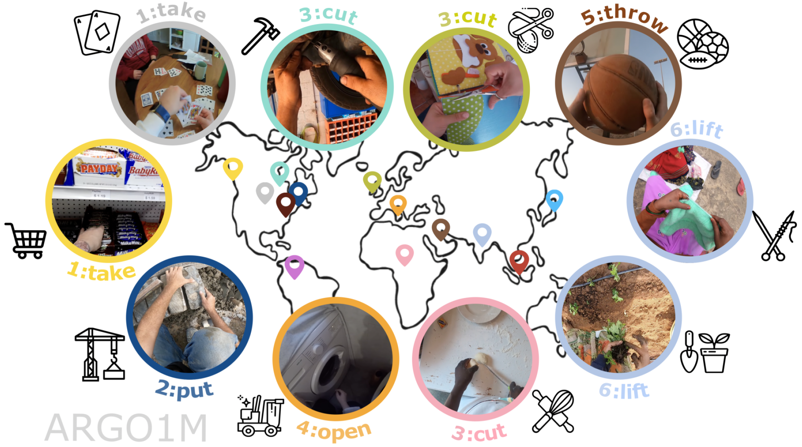

## What can a cook in Italy teach a mechanic in India? Action Recognition Generalisation Over Scenarios and Locations

This is the official implementation for the paper "What can a cook in Italy teach a mechanic in India? Action Recognition Generalisation Over Scenarios and Locations" 

## BibTeX

If you use this repository, please cite: 

<code>@inproceedings{jermsurawong2015predicting,
  title={Predicting the structure of cooking recipes},
  author={Jermsurawong, Jermsak and Habash, Nizar},
  booktitle={Proceedings of the 2015 Conference on Empirical Methods in Natural Language Processing},
  pages={781--786},
  year={2015}}</code>
  
## Requirements
We provide modified training scripts for CIR to replicate paper results. To install dependencies:

<code>conda env create -f environment.yml</code> 

## Dataset: ARGO1M

### CSV 

We provide both the <a href="http://en.wikipedia.org/wiki/Main_Page">CSV</a> files with the corresponding splits, which are <a href="http://en.wikipedia.org/wiki/Main_Page">training.csv</a>, <a href="http://en.wikipedia.org/wiki/Main_Page">seen.csv</a>,  <a href="http://en.wikipedia.org/wiki/Main_Page">japanese_cooking.csv</a>, <a href="http://en.wikipedia.org/wiki/Main_Page">rwanda.csv</a>, <a href="http://en.wikipedia.org/wiki/Main_Page">mechanic.csv</a>, <a href="http://en.wikipedia.org/wiki/Main_Page">sport.csv</a>, <a href="http://en.wikipedia.org/wiki/Main_Page">knitting.csv</a>, <a href="http://en.wikipedia.org/wiki/Main_Page">mechanic_colombia.csv</a>, <a href="http://en.wikipedia.org/wiki/Main_Page">sport_colombia.csv</a>. 

Those contain the following entries: 

- <code>uid</code>: uid of the video clip; 
- <code>scenario_idx</code>: scenario label (index-scenario association in <a href="http://en.wikipedia.org/wiki/Main_Page">scenario_index.txt</a>);
- <code>location_idx</code>: location label (index-location association in <a href="http://en.wikipedia.org/wiki/Main_Page">location_index.txt</a>); 
- <code>label</code>: action label (index-action association in <a href="http://en.wikipedia.org/wiki/Main_Page">action_index.txt</a>);
- <code>timestamp</code>: starting timestamp;
- <code>timeframe</code>: starting timeframe;
- <code>narration</code>: narration; 
- <code>start_feature_idx</code>: starting feature index for SlowFast pre-extracted features;
- <code>end_feature_idx</code>: endinf feature index for SlowFast pre-extracted features.

### FFCV 

We provide the <a href="https://ffcv.io/">FFCV</a> encoding for each split, which are <a href="http://en.wikipedia.org/wiki/Main_Page">training.beton</a>, <a href="http://en.wikipedia.org/wiki/Main_Page">seen.beton</a>,  <a href="http://en.wikipedia.org/wiki/Main_Page">japanese_cooking.beton</a>, <a href="http://en.wikipedia.org/wiki/Main_Page">rwanda.beton</a>, <a href="http://en.wikipedia.org/wiki/Main_Page">mechanic.beton</a>, <a href="http://en.wikipedia.org/wiki/Main_Page">sport.beton</a>, <a href="http://en.wikipedia.org/wiki/Main_Page">knitting.beton</a>, <a href="http://en.wikipedia.org/wiki/Main_Page">mechanic_colombia.beton</a>, <a href="http://en.wikipedia.org/wiki/Main_Page">sport_colombia.beton</a>. 
Those can be found at <a href="https://www.dropbox.com/sh/hsf8assfb9pzjos/AABqlWHx3YQATJZ_Gqnnhsj1a?dl=0">download_ffcv</a>.

We also provide the scripts for extracting them using the given <a href="http://en.wikipedia.org/wiki/Main_Page">CSV</a> files. You can extract FFCVs by running: 

<code>python /scripts/dataset_ffcv_encode.py --config /configs/encode_ffcv.yaml --split train</code>

### Steps for training
